# SDA Hymnal Yoruba - Android

The official Android companion app for [sdahymnalyoruba.com](https://sdahymnalyoruba.com). Browse, search, and present Seventh-day Adventist hymns in Yoruba.

## Screenshots

| Light | Dark |
|:---:|:---:|
| 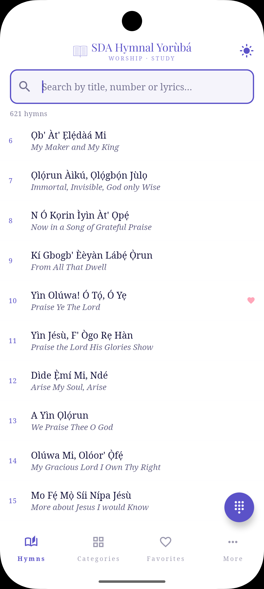 | 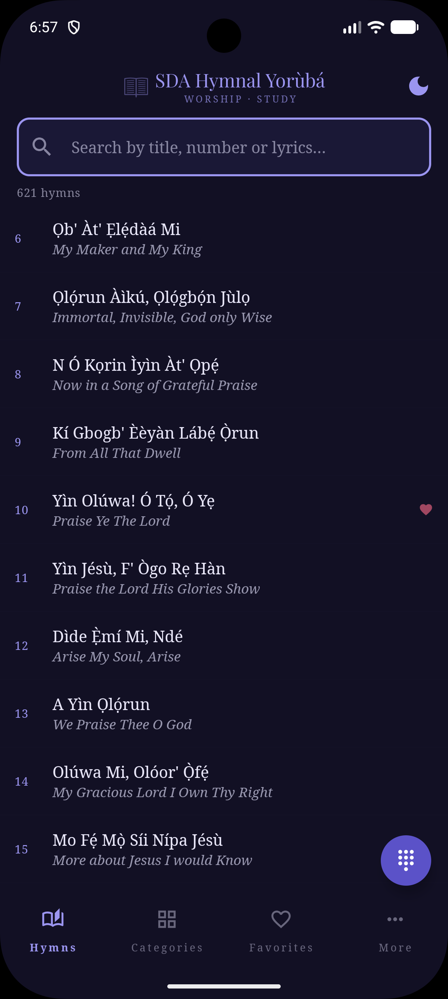 |
| 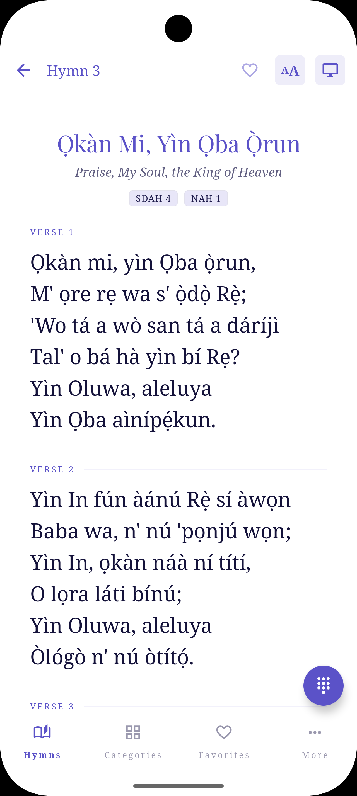 | 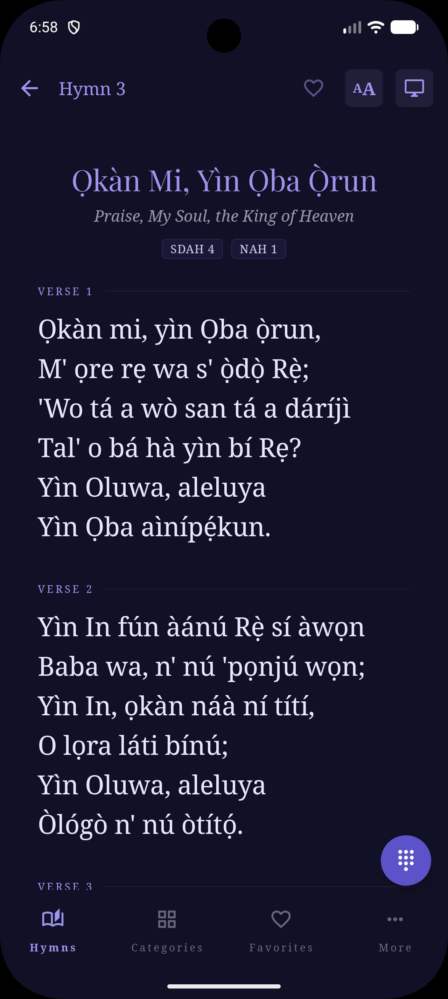 |
| 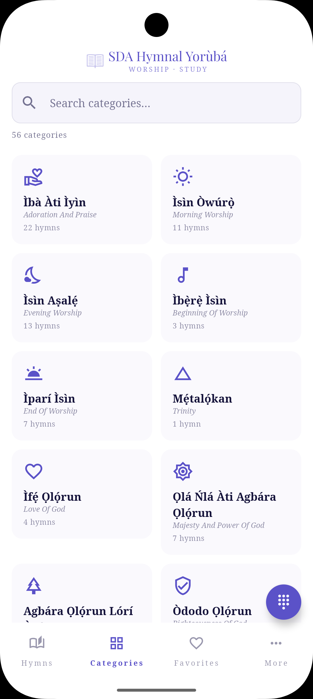 | 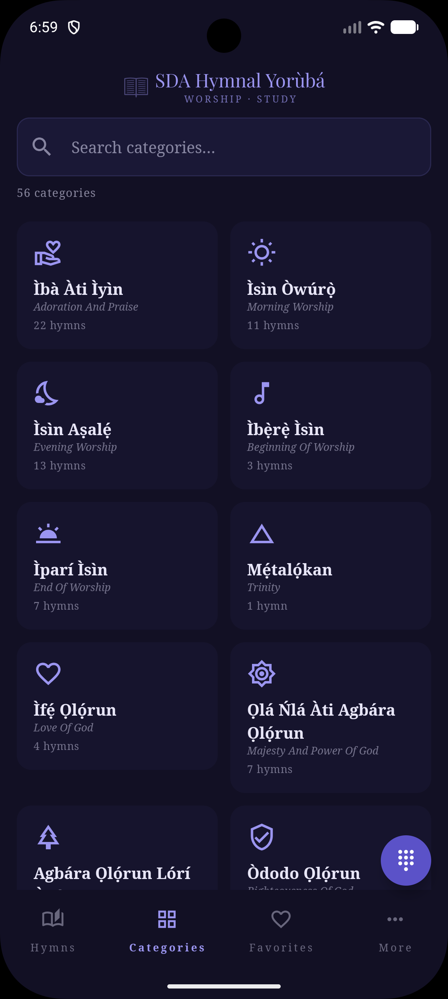 |
| 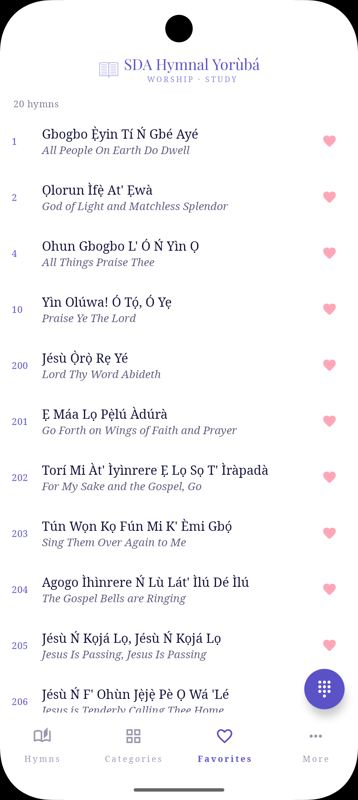 | 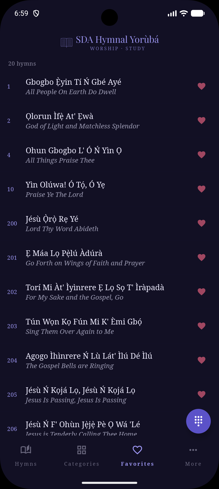 |
| 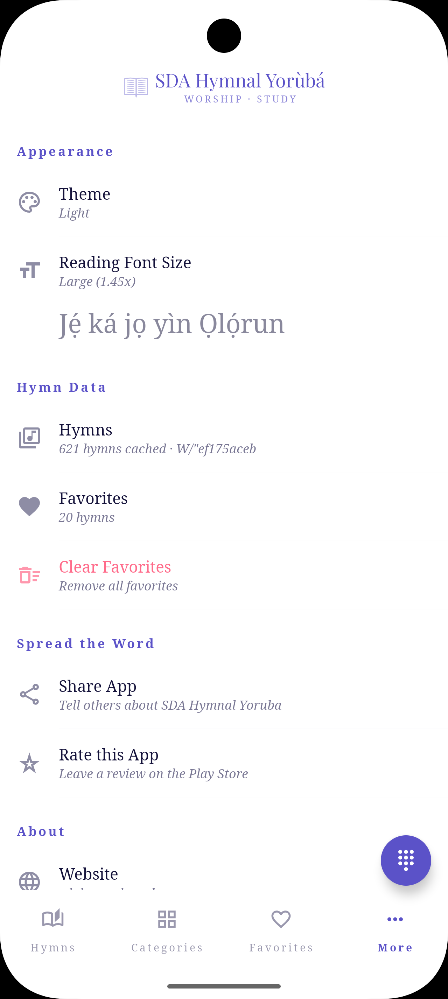 | 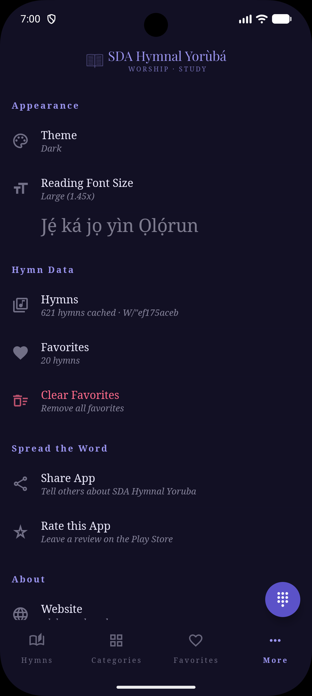 |
| **Presentation Mode** | |
| 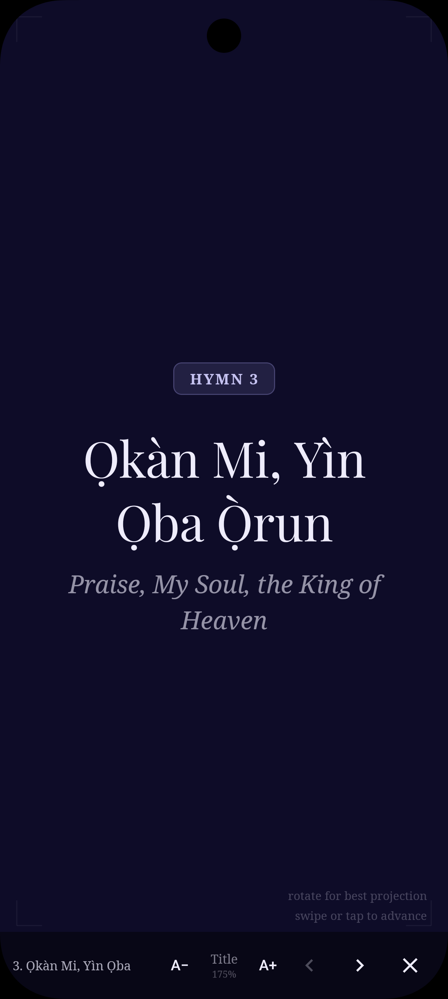 | 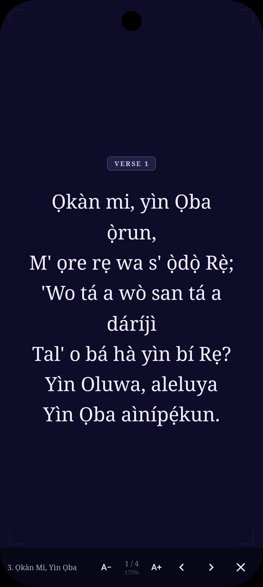 |

## Features

- **620+ hymns** with Yoruba lyrics, English titles, and cross-references (SDAH, NAH, CH)
- **Live data** - fetches hymns from the web with ETag caching (no app update needed for hymn changes)
- **Full-text search** - diacritics-insensitive, scored ranking (number > title > English > references > lyrics), 150ms debounce, search highlighting, empty state with guidance
- **Presentation mode** - full-screen projection with slide-by-slide navigation, staggered line-by-line reveal, swipe/tap controls, adjustable font size with percentage indicator, landscape hint, keeps screen on
- **Categories** - 60+ hymn categories in a 2-column searchable grid with count labels
- **Favorites** - mark hymns via top bar heart, browse in Favorites tab, undo snackbar on removal
- **Number pad** - jump directly to any hymn number via floating keypad with live title preview and validation
- **Settings** - theme picker, font size with live preview, hymn data info, favorites management, share/rate app, contact, privacy policy
- **Theme support** - light, dark, and system modes via dropdown picker (hymn list + settings)
- **Font size controls** - 3 reading sizes (1.0x, 1.2x, 1.45x) with preview text in settings, adjustable presentation size with percentage indicator
- **Swipe navigation** - swipe left/right between hymns with visual drag feedback and rubber-band at boundaries
- **Deep linking** - handles `https://sdahymnalyoruba.com/?hymn=N` URLs reactively (works on cold launch and when app is already open)
- **Share** - share hymn title, number, and URL via Android share sheet
- **Offline support** - atomic cache writes protect offline access from corruption
- **Landscape support** - responsive layout for hymn detail
- **Last hymn recall** - reopens to the last viewed hymn (skipped when deep link is pending)
- **Scroll to selected** - hymn list scrolls to your last viewed hymn on return
- **Keyboard dismiss** - keyboard hides when tapping a hymn from search
- **Analytics** - Umami page views and event tracking, configurable via BuildConfig
- **Accessibility** - 48dp touch targets, content descriptions on functional icons, proper pluralization
- **Localization ready** - all user-facing strings in string resources

## Tech Stack

- **Kotlin** + **Jetpack Compose** (Material 3)
- **MVVM** architecture with `AndroidViewModel` + `StateFlow`
- **OkHttp** for network requests with shared client and ETag-based caching
- **kotlinx.serialization** for JSON parsing (including analytics payloads)
- **Navigation Compose** for screen routing with animated transitions
- **Playfair Display + Noto Serif** fonts (bundled TTFs)
- **Umami** analytics (same dashboard as web app, configurable endpoint)
- **Sentry** for error reporting and ANR detection
- **JUnit 4** for unit tests, **Compose UI Testing** for instrumentation tests

## Requirements

- Android Studio Hedgehog (2023.1) or later
- JDK 17
- Android SDK 35
- Min SDK 26 (Android 8.0)
- Kotlin 2.1+

## Setup

1. Clone the repository
2. Open in Android Studio
3. Sync Gradle
4. Run on device or emulator

No API keys needed. The app fetches hymn data from `https://sdahymnalyoruba.com/hymns.json`.

**Optional configuration** in `local.properties`:
```properties
sentry.dsn=your-sentry-dsn
analytics.endpoint=https://your-umami.example.com/api/send
analytics.website_id=your-website-uuid
analytics.hostname=your.hostname.com
```

## Running on a Device

**Emulator:** Tools > Device Manager > Create Device > Run

**USB debug (app stays installed after unplug):**
1. Enable Developer Options on your phone (Settings > About > tap Build Number 7 times)
2. Enable USB Debugging in Developer Options
3. Connect via USB, approve the prompt
4. Select your device in Android Studio and click Run

## Project Structure

```
app/src/
  main/java/com/sdahymnal/yoruba/
    MainActivity.kt              # Entry point, edge-to-edge, deep link handling
    MainViewModel.kt             # App state (theme, search, favorites, font sizes, analytics, deep links)
    data/
      Hymn.kt                    # Data models (Hymn, LyricBlock, CallResponseLine)
      HymnRepository.kt          # Network + atomic ETag cache + search engine + number lookup
      HymnCategories.kt          # Category definitions with hymn number ranges
      Preferences.kt             # SharedPreferences wrapper (theme, fonts, favorites, ETag)
      Analytics.kt               # Umami client (configurable via BuildConfig, JSON-safe payloads)
      HttpClient.kt              # Shared OkHttpClient singleton (connection pool + dispatcher)
    navigation/
      NavGraph.kt                # Screen routing, bottom nav, number pad FAB, page view tracking
    ui/
      theme/
        Color.kt                 # Color palette (light + dark, presentation, favorites)
        Type.kt                  # Typography (Playfair Display + Noto Serif)
        Theme.kt                 # Material 3 color schemes, findActivity() helper
      screens/
        HymnListScreen.kt        # Branded header, search with highlighting, empty state, loading indicator
        HymnDetailScreen.kt      # Hymn lyrics with swipe feedback, top bar favorite, share
        PresentationScreen.kt    # Full-screen projection with staggered line reveal, font controls
        CategoriesScreen.kt      # 2-column searchable category grid with count labels
        CategoryDetailScreen.kt  # Hymns within a category with count
        FavoritesScreen.kt       # Favorite hymns with undo snackbar on removal
        MoreScreen.kt            # Settings with theme dropdown, font preview, about, share/rate
        LoadingScreen.kt         # Branded shimmer skeleton
        ErrorScreen.kt           # Offline error with retry
      components/
        BrandHeader.kt           # Reusable branded header (book icon + title + subtitle)
        SearchBar.kt             # Search input with clear button
        HymnRow.kt               # Hymn list item (number, title, subtitle, search highlight, favorite heart)
        BottomNavBar.kt          # Bottom navigation (Hymns, Categories, Favorites, More)
        NumberPadDialog.kt       # Go-to-hymn keypad with live title preview
  main/res/
    font/                        # Bundled Playfair Display + Noto Serif TTFs
    drawable/                    # Brand book icon (ic_book_brand)
    mipmap-*/                    # Launcher icons at all densities + monochrome
    values/                      # Colors, strings (localization-ready), themes, splash screen (v31)
    xml/                         # Backup rules, network security config
  test/java/com/sdahymnal/yoruba/
    data/
      RemoveDiacriticsTest.kt    # Diacritics stripping, punctuation, edge cases
      HymnTest.kt                # JSON parsing: verses, chorus, call-response
      SearchScoringTest.kt       # Search ranking, priority, diacritics, call-response
      SearchEdgeCasesTest.kt     # Edge cases: single char, punctuation, long query
      HymnEdgeCasesTest.kt       # Edge cases: empty lyrics, mixed blocks, unicode
      ETagCachingTest.kt         # ETag logic + atomic file write tests
      PreferencesTest.kt         # Font sizes, favorites serialization
    ViewModelLogicTest.kt        # Flow patterns, deep links, search combine, hymn lookup
  androidTest/java/com/sdahymnal/yoruba/
    TestHelpers.kt               # Shared test hymn factory
    HymnListScreenTest.kt        # List display, count, search, click, brand header
    HymnDetailScreenTest.kt      # Title, English title, number, lyrics, references
    FavoritesScreenTest.kt       # Empty state, list, count visibility, brand header
    CategoriesScreenTest.kt      # Grid display, count, empty filtering, brand header
    MoreScreenTest.kt            # All sections, theme, fonts, favorites, dialog
```

## Architecture

```
MainActivity
  |
  +-- MainViewModel (single source of truth)
  |     |
  |     +-- HymnRepository (network + cache + search)
  |     |     +-- HttpClient.base (shared OkHttpClient singleton)
  |     |     +-- Pre-built search index + number lookup map
  |     |     +-- Atomic file cache (temp + rename)
  |     |
  |     +-- Preferences (SharedPreferences, single instance)
  |     |     +-- Theme, font sizes, favorites, last hymn, ETag
  |     |
  |     +-- Analytics (Umami, configurable via BuildConfig)
  |           +-- Derived OkHttpClient with shorter timeouts
  |           +-- JSON-safe payload construction
  |           +-- All tracking routed through ViewModel
  |
  +-- NavGraph (Compose Navigation)
        +-- Bottom nav (Hymns, Categories, Favorites, More)
        +-- Number pad FAB
        +-- Animated transitions (fade + slide)
        +-- Page view tracking on route changes
        +-- Tab state derived from navigation (not composition side effects)
        +-- Screen composables (stateless, receive state via params)
```

## Data Flow

```
App launch
  |
  +-- Load cached hymns from file (instant)
  +-- Build search index + number lookup map (once)
  +-- Send GET with If-None-Match: <stored-etag>
  |
  +-- Server returns 304? --> keep cached data (no download)
  +-- Server returns 200? --> atomic write (temp + rename) + new ETag, rebuild index
  +-- Network error + cache exists? --> silently use cache
  +-- Network error + no cache? --> show error screen with retry
```

## Analytics Events

All events are prefixed with `android_` to distinguish from web traffic in the shared Umami dashboard. Page views are tracked on every route change.

| Event | When |
|---|---|
| `android_app_launch` | App opens |
| `android_hymn_42` | Hymn viewed |
| `android_search_oluwa` | Search (1s debounce, max 50 chars) |
| `android_presented_42` | Presentation mode entered |
| `android_share_42` | Hymn shared |
| `android_theme_dark` | Theme selected |
| `android_category_adoration` | Category tapped |
| `android_favorite_42` | Hymn favorited |
| `android_unfavorite_42` | Hymn unfavorited |
| `android_clear_favorites` | All favorites cleared |
| `android_numpad_42` | Number pad used |
| `android_fontsize_1.2` | Font size changed |
| `android_share_app` | App shared from settings |
| `android_rate_app` | Rate app tapped |

## Testing

**Unit tests**: `app/src/test` - run via right-click > Run Tests

**UI tests**: `app/src/androidTest` - requires emulator or device

| Category | Unit | UI | Total |
|---|---|---|---|
| Search & normalization | 17 | - | 17 |
| Data parsing | 13 | - | 13 |
| ViewModel & flow patterns | 20 | - | 20 |
| ETag caching & atomic writes | 10 | - | 10 |
| Preferences | 4 | - | 4 |
| Hymn List Screen | - | 5 | 5 |
| Hymn Detail Screen | - | 5 | 5 |
| Favorites Screen | - | 5 | 5 |
| Categories Screen | - | 4 | 4 |
| More Screen | - | 9 | 9 |

## Related

- **Web app**: [github.com/fisayoafolayan/sdahymnalyorubaweb](https://github.com/fisayoafolayan/sdahymnalyorubaweb)
- **Live site**: [sdahymnalyoruba.com](https://sdahymnalyoruba.com)

## License

This project is licensed under the MIT License - see the [LICENSE](LICENSE) file for details.
